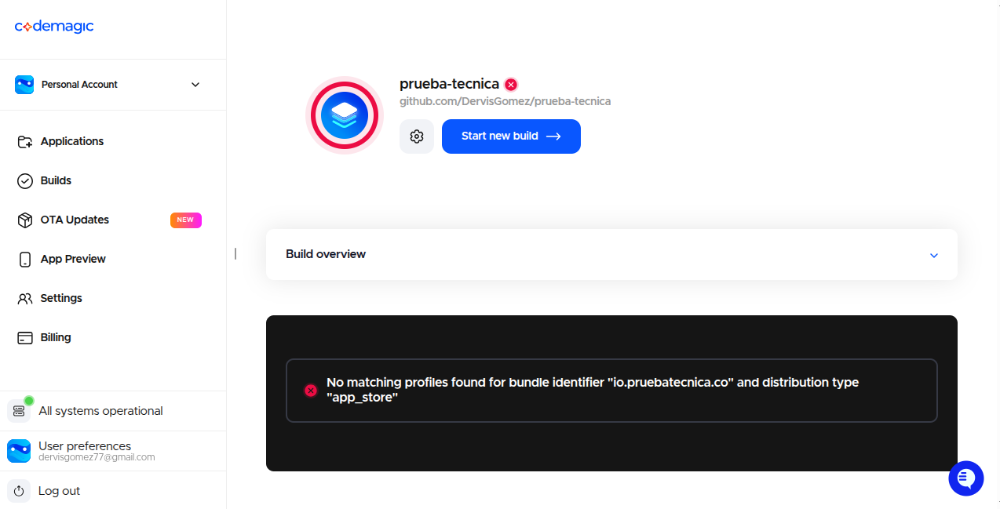

# Prueba Tecnica Mobile - Ionic + Angular

Aplicacion To-Do desarrollada con Ionic y Angular, con soporte hibrido para Android/iOS via Cordova.

**Repositorio publico:** [https://github.com/DervisGomez/prueba-tecnica](https://github.com/DervisGomez/prueba-tecnica)

## Repositorio (versionamiento)

- **GitHub:** [github.com/DervisGomez/prueba-tecnica](https://github.com/DervisGomez/prueba-tecnica)
- **Remoto Git:** `https://github.com/DervisGomez/prueba-tecnica.git`
- **Clonar:**

```bash
git clone https://github.com/DervisGomez/prueba-tecnica.git
cd prueba-tecnica
```

Segun las instrucciones de la prueba, conviene trabajar en una **rama** dedicada y entregar el enlace al remoto con el historial de **commits** claro (mensajes descriptivos, cambios acotados por commit).

## Descarga APK (Android)

- **Pagina del release:** [Prueba Tecnica - APK (tag `V1.0.0`)](https://github.com/DervisGomez/prueba-tecnica/releases/tag/V1.0.0) — en **Assets** esta el fichero `app-release.apk`.
- **Descarga directa:** [app-release.apk](https://github.com/DervisGomez/prueba-tecnica/releases/download/V1.0.0/app-release.apk)

Build **release** firmada; instalar en dispositivo Android permitiendo fuentes desconocidas si el sistema lo pide.

El `app-release.apk` en **Assets** de ese release se actualizo para el ultimo build: Firebase activo en produccion (`environment.prod.ts`) y **Remote Config** operativo en el APK (mismo enlace de descarga).

## Evidencia visual (producto y Remote Config)

- **Video — Remote Config `enable_categories` = true** (categorias visibles): [Google Drive — reproducir](https://drive.google.com/file/d/1QzJg2CHpry6Qw7OrcuzHJ9G7z9JZ_kDF/view?usp=sharing)
- **Video — Remote Config `enable_categories` = false** (categorias ocultas / sin gestion ni filtro): [Google Drive — reproducir](https://drive.google.com/file/d/18aSUKu6WQ7bf4KkWQg6P35TxoXCrxhhA/view?usp=sharing)

## iOS, IPA y Codemagic (CI sin Mac)

### Situacion de la entrega

- **Sin Mac local:** la compilacion iOS se plantea en **Codemagic** (runner macOS en la nube), alineado con el enunciado de la prueba.
- **Sin Apple Developer Program (cuenta de pago):** Apple exige suscripcion activa para **certificados de distribucion**, **perfiles de aprovisionamiento** y uso estable de **App Store Connect API** con los que Codemagic firma y exporta un **IPA** instalable fuera de un entorno de desarrollo muy limitado. **Por eso no hay enlace publico a un `.ipa`** en esta entrega: no es un vacio de conocimiento sobre CI, sino un **requisito externo** que no estaba disponible en el momento de la entrega.
- **Lo que si queda en el repositorio:** el workflow declarado en [`codemagic.yaml`](codemagic.yaml) (workflow `ios-ipa`: dependencias npm, `ionic cordova` iOS, CocoaPods, `xcode-project use-profiles`, generacion del IPA como artefacto). Documentacion oficial seguida: [Ionic Cordova en Codemagic](https://docs.codemagic.io/yaml-quick-start/building-a-cordova-app/).

### Evidencia de pipeline Codemagic (firma Apple)

Se ejecuto un build del workflow **`ios-ipa`**. El error esperado sin perfiles de distribucion en el equipo de Codemagic confirma que el pipeline usa el bundle **`io.pruebatecnica.co`** y el tipo **`app_store`**:



Mensaje mostrado por Codemagic: *No matching profiles found for bundle identifier `io.pruebatecnica.co` and distribution type `app_store`.* (captura versionada en [`docs/evidence/codemagic-ios-ipa-signing-error.png`](docs/evidence/codemagic-ios-ipa-signing-error.png); listada en [`docs/evidence/FILES.txt`](docs/evidence/FILES.txt)).

### Que debe completar quien disponga de cuenta Apple (evaluador u otro entorno)

1. **Apple Developer Program** activo y App ID con bundle **`io.pruebatecnica.co`** (coincide con `config.xml`).
2. En **App Store Connect**, crear una **API key** (.p8) con permisos adecuados (p. ej. rol tipo App Manager).
3. En **Codemagic** → Team settings → **Integrations** → App Store Connect: registrar la clave con el **mismo nombre** que en `codemagic.yaml` → `integrations.app_store_connect` (actualmente **`prueba-tecnica-asc`**). Si se usa otro nombre, hay que cambiar esa cadena en el YAML y hacer push.
4. En **Code signing identities** de Codemagic: certificado de distribucion y **provisioning profile** tipo **App Store** para ese bundle (o ajustar `distribution_type` en el YAML si se usa Ad Hoc con UDIDs).
5. Lanzar el workflow **`ios-ipa`** en la rama que contenga este `codemagic.yaml`; al terminar, descargar el **IPA** desde **Artifacts** y publicar el enlace (p. ej. en un GitHub Release junto al APK).

### Ajustes frecuentes si el primer build falla

- **`XCODE_WORKSPACE` / `XCODE_SCHEME`:** deben coincidir con el proyecto generado en `platforms/ios/` (derivado del `<name>` en `config.xml`, hoy **"Prueba Tecnica"**). Si Xcode en CI reporta otro scheme, actualizar las variables en `codemagic.yaml`.

## Estado frente al enunciado (resumen)

| Requisito de la prueba | Estado |
| --- | --- |
| Repositorio Git publico y codigo versionado | **Listo** — enlace arriba |
| Estructura Cordova Android + iOS e instrucciones en README | **Listo** — `config.xml`, plataformas en `package.json`, secciones Android/iOS |
| App base To-Do (agregar, completar, eliminar; edicion) | **Listo** |
| Categorias (CRUD, asignar a tarea, filtrar) | **Listo** |
| Firebase + Remote Config (feature flag) | **Listo en codigo** — proyecto en `environment*.ts`; en consola Firebase debe existir el parametro booleano `enable_categories` |
| Optimizacion de rendimiento (carga, muchas tareas, memoria) | **Listo** — mejoras en app + informe con metricas en `docs/informe-rendimiento.md` |
| APK / IPA y enlaces de descarga | **APK listo** — [release V1.0.0](https://github.com/DervisGomez/prueba-tecnica/releases/tag/V1.0.0). **IPA:** sin binario publico por falta de **Apple Developer Program**; pipeline **Codemagic** documentado arriba y en [`codemagic.yaml`](codemagic.yaml) |
| Evidencia visual (capturas o video de funcionalidades y del flag) | **Listo** — [`enable_categories` = true](https://drive.google.com/file/d/1QzJg2CHpry6Qw7OrcuzHJ9G7z9JZ_kDF/view?usp=sharing) / [`enable_categories` = false](https://drive.google.com/file/d/18aSUKu6WQ7bf4KkWQg6P35TxoXCrxhhA/view?usp=sharing) (ver [Evidencia visual](#evidencia-visual-producto-y-remote-config)) |
| Respuestas escritas: desafios, optimizacion, calidad/mantenibilidad | **Listo** — reflexion corta en [`docs/reflexion-entrega.md`](docs/reflexion-entrega.md); metricas de rendimiento en [`docs/informe-rendimiento.md`](docs/informe-rendimiento.md) |

## Resumen de cambios (entrega)

Lista corta de lo que se añadio o modifico respecto a una To-Do base, para cumplir el enunciado y documentar la entrega:

- **Categorias:** CRUD, asignacion por tarea, filtro en listado y pantallas en `src/app/features/categories/`; guard de rutas segun flag.
- **Firebase Remote Config:** integracion en `environment*.ts`, servicio de flags (`feature-flags.service.ts`), parametro booleano `enable_categories` que muestra u oculta gestion y filtro de categorias.
- **Rendimiento:** estrategia OnPush, lista paginada con infinite scroll, proyecciones y mapas para evitar trabajo repetido con muchas tareas; detalle y metricas en [`docs/informe-rendimiento.md`](docs/informe-rendimiento.md).
- **Build hibrido:** Cordova Android/iOS documentado en este README; APK en [GitHub Releases](https://github.com/DervisGomez/prueba-tecnica/releases/tag/V1.0.0) (artefacto en **Assets** alineado al build con Firebase en prod y Remote Config).
- **iOS / IPA:** workflow [`codemagic.yaml`](codemagic.yaml) (`ios-ipa`) y seccion README sobre firma; sin `.ipa` publico por requisitos de **Apple Developer Program** (pasos para completarlo con evaluador o cuenta propia).
- **Documentacion de entrega:** respuestas narrativas en [`docs/reflexion-entrega.md`](docs/reflexion-entrega.md); evidencia de Remote Config en video (enlaces arriba); inventario de ficheros de evidencia en [`docs/evidence/FILES.txt`](docs/evidence/FILES.txt).

## Alcance implementado (detalle)

- **Tareas:** CRUD completo (crear, editar, completar, eliminar) con persistencia local (`@ionic/storage-angular`).
- **Categorias:** crear, editar, eliminar; asignar categoria a cada tarea; filtrar listado por categoria; UI en `src/app/features/categories/`.
- **UI y rutas:** Ionic Components, enrutamiento modular, guard de acceso a categorias segun feature flag (`src/app/core/guards/categories-feature.guard.ts`).
- **Firebase Remote Config:** servicio `src/app/core/services/feature-flags.service.ts`; flag `enable_categories` condiciona rutas, filtros, selector en formulario y gestion de categorias.
- **Rendimiento:** `ChangeDetectionStrategy.OnPush`, lista con `ion-infinite-scroll`, proyeccion de estado en una pasada, mapa `id -> categoria`, orden unico con `sort` (ver seccion mas abajo).
- **Datos de prueba / laboratorio:** en desarrollo, funciones globales `seedPerfScenario` / `clearPerfScenario` en consola del navegador (documentadas en este README).
- **CI iOS (Codemagic):** [`codemagic.yaml`](codemagic.yaml) con workflow `ios-ipa` para generar IPA en la nube; requiere Apple Developer Program y credenciales en Codemagic (detalle en [iOS, IPA y Codemagic](#ios-ipa-y-codemagic-ci-sin-mac)).

## Stack tecnico

- Ionic Angular 8
- Angular 20
- Cordova (`cordova-android`, `cordova-ios`)
- Ionic Storage

## Requisitos previos

- Node.js 20+ (recomendado LTS)
- npm 10+
- Ionic CLI
- Java JDK (para Android)
- Android Studio (SDK + emulator)
- Xcode (solo macOS, para iOS)
- CocoaPods (iOS)

Instalar Ionic CLI:

```bash
npm install -g @ionic/cli
```

## Instalacion del proyecto

Desde la raiz del repositorio:

```bash
npm install
```

## Ejecucion en navegador

```bash
ionic serve
```

## Estructura hibrida Cordova

La aplicacion esta configurada con Cordova en:

- `config.xml`
- `package.json` (seccion `cordova`)

Plataformas declaradas: `android` e `ios`.

Si necesitas recrearlas:

```bash
ionic cordova platform rm android ios
ionic cordova platform add android
ionic cordova platform add ios
```

## Ejecutar en Android

Compilar y correr en dispositivo/emulador:

```bash
ionic cordova run android
```

Build release (APK/AAB segun configuracion):

```bash
ionic cordova build android --release
```

APK tipico de salida:

`platforms/android/app/build/outputs/apk/release/app-release.apk`

## Ejecutar en iOS (requiere macOS)

Compilar y abrir en Xcode:

```bash
ionic cordova build ios
open platforms/ios/*.xcworkspace
```

Desde Xcode:

1. Configurar Team de firma.
2. Seleccionar dispositivo destino.
3. Archive > Distribute App para exportar `.ipa`.

## Firebase + Remote Config (Feature Flag)

**Estado:** integracion lista en la aplicacion (`firebase` + `getRemoteConfig` en `feature-flags.service.ts`, configuracion en `src/environments/environment.ts` y `environment.prod.ts`). Tras `npm install`, la app inicializa Firebase cuando `firebase.enabled` es `true` y la configuracion esta completa.

### Objetivo de la feature flag

Controlar una funcionalidad sin publicar nueva version (ejemplo: habilitar/deshabilitar categorias).

En esta app se usa el flag remoto `enable_categories` para mostrar/ocultar:

- boton de gestion de categorias,
- filtro por categorias,
- selector de categoria en formulario de tarea,
- acceso a la ruta `categorias`.

### Checklist en Firebase Console (para quien despliegue o evalúe)

1. Proyecto Firebase con app Web (y opcionalmente Android/iOS para builds nativos).
2. **Remote Config:** crear parametro **booleano** `enable_categories` (valores por defecto y condiciones segun necesidad).
3. Publicar cambios de Remote Config tras editarlos.
4. **Prueba funcional:** con `true`, categorias visibles y ruta accesible; con `false`, UI de categorias y filtro desactivados segun implementacion actual.

Archivos nativos opcionales para builds Cordova: `google-services.json` (Android), `GoogleService-Info.plist` (iOS), segun guia de Firebase para Cordova.

## Optimizacion de rendimiento

**Estado:** mejoras aplicadas en codigo e **informe de medicion** en [`docs/informe-rendimiento.md`](docs/informe-rendimiento.md) (LCP, INP, CLS, heap snapshots, escenarios S1/S2/S3). Lista de capturas referenciada en `docs/evidence/FILES.txt` (subir los PNG al repo o enlazarlos si se entregan fuera).

### Mejoras aplicadas

- `ChangeDetectionStrategy.OnPush` en modulos de tareas/categorias.
- Carga incremental para listas grandes con `ion-infinite-scroll` y tamano de pagina fijo.
- Estado reactivo con `BehaviorSubject` y `Observable`.
- Proyeccion del ViewModel de tareas en una sola pasada:
  - filtrado,
  - conteo pendientes/completadas,
  - armado de lista visible.
- Eliminacion de busquedas repetidas por categoria en template (diccionario `id -> categoria`).
- Ordenamiento de tareas optimizado con una sola pasada de `sort` (antes se hacian filtros + sort por separado).

### Protocolo de medicion y evidencia (reproducir en laboratorio)

#### 1) Escenarios de volumen

Probar al menos estos tres escenarios:

- S1: 100 tareas
- S2: 1,000 tareas
- S3: 5,000 tareas

Distribucion sugerida:

- 70% pendientes y 30% completadas.
- 20% sin categoria y 80% distribuidas entre 5-10 categorias.

Carga automatica disponible en entorno de desarrollo:

1. Ejecutar `ionic serve`.
2. Abrir la app en el navegador y luego DevTools Console.
3. Ejecutar uno de estos comandos:

```js
await window.seedPerfScenario('S1'); // 100 tareas
await window.seedPerfScenario('S2'); // 1,000 tareas
await window.seedPerfScenario('S3'); // 5,000 tareas
```

Tambien puedes usar un numero personalizado:

```js
await window.seedPerfScenario(2500); // 2,500 tareas
```

Para limpiar datos de prueba:

```js
await window.clearPerfScenario();
```

#### 2) Metricas minimas

- Carga inicial: tiempo desde apertura hasta pantalla interactiva.
- Lista grande: tiempo de respuesta en scroll, cambio de filtro y acciones de tarea.
- Memoria: heap inicial vs heap final tras interacciones repetidas.

#### 3) Herramienta y pasos (Chrome DevTools)

1. Levantar app en navegador con `ionic serve`.
2. Abrir DevTools (`F12`).
3. En `Performance`: grabar perfil al recargar y durante interacciones.
4. En `Memory`: tomar snapshot inicial y final.

Secuencia de interacciones por escenario (repetir 3 veces y promediar):

1. Cargar dataset del escenario.
2. Cerrar y abrir app.
3. Medir carga inicial.
4. Scroll continuo por 20-30 segundos.
5. Cambiar filtros 10 veces.
6. Completar/descompletar 30 tareas.
7. Editar 20 tareas.
8. Medir memoria final.

#### 4) Plantilla de resultados (copiar y completar)

Entorno de prueba:

- SO:
- CPU/RAM:
- Navegador y version:
- Node/Ionic:

Resultados (promedio de 3 corridas):

| Escenario | Carga inicial (ms) | Cambio de filtro (ms) | Toggle tarea (ms) | Fluidez scroll | Heap inicial (MB) | Heap final (MB) |
| --- | ---: | ---: | ---: | --- | ---: | ---: |
| S1 (100) |  |  |  |  |  |  |
| S2 (1,000) |  |  |  |  |  |  |
| S3 (5,000) |  |  |  |  |  |  |

Evidencia adjunta:

- Captura de `Performance` (carga inicial).
- Captura de `Performance` (scroll + filtros).
- Captura de `Memory` (heap inicial/final).
- Video corto (30-60s) mostrando uso con lista grande.

#### 5) Respuesta sugerida para la pregunta de optimizacion

Tecnicas aplicadas y motivo:

- `OnPush` para reducir renders innecesarios en componentes principales.
- Carga incremental (`ion-infinite-scroll`) para evitar render masivo inicial.
- Proyeccion del ViewModel en una sola pasada para reducir trabajo por actualizacion.
- Diccionario `id -> categoria` para evitar busquedas repetidas por item renderizado.
- Ordenado de tareas con una sola operacion de `sort` para menor costo de CPU/memoria.

## Pruebas y calidad

Comandos:

```bash
npm run lint
npm test
```

Recomendado agregar pruebas para:

- `TaskService` (alta/edicion/completado/eliminacion)
- `CategoryService` (CRUD + descategorizacion de tareas al borrar)
- filtro por categoria en vista de tareas

## Entregables de la prueba (que pide el enunciado vs este repo)

| Entregable | En este repositorio |
| --- | --- |
| Codigo + README | **Si** — este archivo y codigo en `src/` |
| Evidencia visual (capturas o video) | **Listo** — [video flag `true`](https://drive.google.com/file/d/1QzJg2CHpry6Qw7OrcuzHJ9G7z9JZ_kDF/view?usp=sharing), [video flag `false`](https://drive.google.com/file/d/18aSUKu6WQ7bf4KkWQg6P35TxoXCrxhhA/view?usp=sharing) |
| APK e IPA + enlaces de descarga | **APK** — [release V1.0.0](https://github.com/DervisGomez/prueba-tecnica/releases/tag/V1.0.0) / [descarga directa](https://github.com/DervisGomez/prueba-tecnica/releases/download/V1.0.0/app-release.apk). **IPA** — ver [iOS, IPA y Codemagic](#ios-ipa-y-codemagic-ci-sin-mac): workflow listo; enlace al `.ipa` condicionado a credenciales Apple en Codemagic |
| Respuestas: desafios, optimizacion, calidad | **Listo** — [`docs/reflexion-entrega.md`](docs/reflexion-entrega.md); detalle de medicion en [`docs/informe-rendimiento.md`](docs/informe-rendimiento.md) |

## Checklist final de entrega

- [x] Repositorio publico con historial Git — [https://github.com/DervisGomez/prueba-tecnica](https://github.com/DervisGomez/prueba-tecnica)
- [x] README con instalacion, Cordova Android/iOS, Firebase/Remote Config, rendimiento y mapa de estado de la prueba
- [x] Firebase y Remote Config integrados en aplicacion (verificar param `enable_categories` en consola y publicar cambios)
- [x] Feature flag `enable_categories` implementada en codigo — videos: [`true`](https://drive.google.com/file/d/1QzJg2CHpry6Qw7OrcuzHJ9G7z9JZ_kDF/view?usp=sharing) / [`false`](https://drive.google.com/file/d/18aSUKu6WQ7bf4KkWQg6P35TxoXCrxhhA/view?usp=sharing)
- [x] Rendimiento optimizado en codigo y justificado con informe — [`docs/informe-rendimiento.md`](docs/informe-rendimiento.md)
- [x] APK generado y **enlace de descarga** publicado — [release V1.0.0](https://github.com/DervisGomez/prueba-tecnica/releases/tag/V1.0.0)
- [x] IPA / iOS: **Codemagic** configurado en [`codemagic.yaml`](codemagic.yaml) y limitacion **sin Apple Developer Program** documentada en README y [`docs/reflexion-entrega.md`](docs/reflexion-entrega.md). **Enlace publico a `.ipa`:** pendiente hasta aportar cuenta Apple + firma en Codemagic (pasos en seccion *iOS, IPA y Codemagic*)
- [x] Capturas o video de **funcionalidades de producto** — [Remote Config `true`](https://drive.google.com/file/d/1QzJg2CHpry6Qw7OrcuzHJ9G7z9JZ_kDF/view?usp=sharing) / [Remote Config `false`](https://drive.google.com/file/d/18aSUKu6WQ7bf4KkWQg6P35TxoXCrxhhA/view?usp=sharing)
- [x] Texto de entrega: **desafios**, **optimizacion** y **calidad/mantenibilidad** — [`docs/reflexion-entrega.md`](docs/reflexion-entrega.md)

## Notas sobre IPA en Linux/Windows

En Linux/Windows puedes desarrollar y generar **Android** sin problema. Para un **IPA** necesitas macOS + Xcode **o** CI en la nube (este repo documenta **Codemagic** en la seccion [iOS, IPA y Codemagic](#ios-ipa-y-codemagic-ci-sin-mac)). Sin **Apple Developer Program** no se obtiene un IPA de distribucion listo para evaluadores externos de la forma habitual; el YAML y el README dejan el camino listo cuando exista esa cuenta.
