# Informe de rendimiento (laboratorio)

**Aplicación:** To-Do Ionic + Angular (modo desarrollo con `ionic serve`, `http://localhost:8100`)  
**Herramienta:** Chrome DevTools → `Performance` (Live metrics + trazas) y `Memory` (**Heap snapshots**)  
**Objetivo del enunciado:** mejorar **carga inicial**, **manejo de muchas tareas** y **memoria**, con evidencia.

---

## 1) Resumen (lo que importa)

En laboratorio, la app se comporta **estable visualmente**: **CLS = 0** de forma consistente en las mediciones registradas.

La **carga inicial (LCP)** quedó en un rango **razonable** para una app Angular/Ionic en *dev* en los escenarios medidos (típicamente **~1.87–2.37s** en S1/S2 y **~2.32s** en una traza corta de S3).

El principal hallazgo —y el más alineado con “grandes cantidades de tareas”— es la **interactividad (INP)**: al subir el volumen, aparecen **peores interacciones** que bloquean el hilo principal (**long tasks**) y se observa un crecimiento fuerte de **nodos DOM**, **listeners** y **JS heap** en S3. En otras palabras: **no se “rompe el layout”**, pero **sí aumenta el costo de usar la lista** cuando el volumen es muy alto.

En paralelo, los **heap snapshots** confirman que el **modelo de datos** crece con el escenario (S2 vs S3) y que el runtime mantiene una cantidad de objetos coherente con el volumen (por ejemplo, ~**5,001** objetos con forma de tarea en S3).

---

## 2) Qué se optimizó en el producto (contexto)

Para atacar exactamente los tres puntos del enunciado:

- **OnPush** para reducir renders innecesarios.
- **Lista incremental** (`ion-infinite-scroll`) para no pintar todo de golpe.
- **Menos trabajo por actualización** (proyección del estado en una sola pasada).
- **Menos búsquedas repetidas** por categoría (mapa `id → categoría`).
- **Ordenamiento** más eficiente al persistir/reordenar (un `sort` en lugar de múltiples pasadas).

Estas mejoras ayudan, pero **no eliminan por completo** el costo de tener miles de ítems “vivos” en UI + eventos; por eso la evidencia de S3 es valiosa: muestra dónde queda el cuello cuando el estrés es alto.

---

## 3) Cómo se midió (reproducible)

**Escenarios de datos**

| Escenario | Tareas |
| --- | ---: |
| S1 | 100 |
| S2 | 1,000 |
| S3 | 5,000 |

**Protocolo (por escenario)**

1. Generar datos (`seedPerfScenario`) y recargar.
2. Mantener la pestaña **en foco**.
3. `Performance` → **Live metrics** (LCP/CLS/INP tras uso real).
4. `Record and reload` (carga inicial; LCP en Insights).
5. `Record` (30–40s; interacción: scroll + filtros + toggles).

**Memoria (Heap snapshot)**

1. `Memory` → **Heap snapshot** → **Tomar instantánea** en un estado estable (típicamente post-carga).

> Nota: el nombre “Instantánea 2” es solo el **orden** dentro de DevTools; conviene referirse como “S2 post-carga”, etc., para evitar ambigüedad.

**Condiciones / limitaciones (honestidad técnica)**

- Es **dev server** (`localhost`): suele inflar **scripting** vs producción.
- Puede haber **ruido** por extensiones (en alguna sesión apareció React Dev Tools).
- INP es **“peor interacción”** y varía con el guion; por eso se reporta como **rango** cuando aplica.

**Hardware / versiones**

- No se documentó el detalle de máquina en esta versión del informe (medición local).

---

## 4) Resultados (por escenario)

### S1 (100) — baseline

- **Live metrics:** LCP ~**2.31s** (*good*), CLS **0**, INP ~**144ms** (*good*).
- **Reload (Insights):** LCP ~**1.87s** (*good*), CLS **0**.
- **Interacción (traza):** INP ~**352ms** (*needs improvement*) en una sesión más exigente.
- **Memoria (Heap snapshot):** **~26.7 MB** (instantánea capturada en sesión S1).

**Lectura:** baseline sano; aún así INP puede subir si se fuerza el uso.

### S2 (1,000) — aparece el costo “real” de escala moderada

- **Live metrics:** INP ~**416ms** (*needs improvement*), CLS **0**; el patrón apunta a interacciones en **`ion-segment-button`** (cambio de filtro).
- **Reload (Insights):** LCP entre ~**1.97s** y ~**2.37s** (*good*), CLS **0**; scripting alto al inicio + **long tasks**; se vio **`Firebase:fetch`** en arranque; sugerencia de caché ~**6.1MB** y payload grande desde `localhost` (~**6.1MB**), típico de *dev*.
- **Interacción (trazas):** INP peor caso observado ~**511–632ms** (*poor*), CLS **0**, correlación con **long tasks** durante puntero.
- **Memoria (Heap snapshot):** **~31.6 MB** con UI mostrando **700 pendientes + 300 completadas = 1,000 tareas** (coherente con S2). El resumen del snapshot muestra predominio de **`(compiled code)`** y **`(string)`**, típico del runtime de Chrome + aplicación en modo desarrollo.

**Lectura:** el riesgo principal ya no es “cargar”, sino **mantener la UI fluida** al interactuar con muchas tareas.

### S3 (5,000) — se confirma el cuello de escala (interacción + memoria/DOM)

**Traza corta (~4.92s)**

- **LCP:** ~**2.32s** (*good*)
- **INP:** ~**520ms** (*poor*)
- **CLS:** **0**
- **Resumen:** scripting ~**1,337ms** en ~4.92s (dominante)
- **Memoria / estructura (desde el panel de Performance):**
  - **JS heap** con salto fuerte (orden **15 → 26.4 MB** en el tramo observado)
  - **Nodes** con salto grande (orden **~1,000 → >6,000**)
  - **Listeners** aumentan de forma notable

**Traza larga (~31.10s)**

- **INP:** ~**879ms** (*poor*) como peor interacción del intervalo
- **CLS:** **0**
- **Resumen:** scripting ~**3,380ms** acumulado + rendering/painting relevantes en ~31s
- **Memoria / estructura (desde el panel de Performance):**
  - **JS heap** ~**12.8 → 23.3 MB**
  - **Nodes** ~**3,412 → 12,168**
  - **Listeners** ~**1,467 → 5,317**

**Lectura:** S3 demuestra con claridad el trade-off: **CLS perfecto**, pero **INP malo** y un aumento grande de **nodos/listeners/heap** → la app “se siente” cuando el volumen es alto, aunque visualmente no “salte”.

**Memoria (Heap snapshot)**

- **~39.2 MB** total en el snapshot analizado.
- En el resumen por constructor aparece el objeto con forma **`{id, title, completed, createdAt, categoryId}`** con **~5,001** instancias, consistente con **5,000 tareas** en el dataset (más el overhead normal del runtime).

---

## 5) Tabla consolidada (lectura rápida)

| Escenario | LCP (reload / trazas) | INP (live / peor traza) | CLS | Memoria (snapshots) |
| --- | --- | --- | --- | --- |
| S1 | ~1.87–2.31s | ~144ms / ~352ms | 0 | **~26.7 MB** (heap snapshot) |
| S2 | ~1.97–2.37s | ~416ms / ~511–632ms | 0 | **~31.6 MB** (heap snapshot; UI 700/300) |
| S3 | ~2.32s (traza corta) | ~520ms / ~879ms | 0 | **~39.2 MB** (heap snapshot; ~5,001 objetos tarea) |

> Nota: LCP “live” a veces no aparece si la vista está centrada en interacción; por eso LCP se ancla principalmente a **Insights** en reload cuando está disponible.

---

## 6) Conclusión para evaluación (directa)

Cumplimos el objetivo del enunciado en el sentido fuerte: hay **estrategia**, **medición** y **evidencia** de cómo escala el costo con el volumen.

- **Carga inicial:** LCP se mantiene mayormente en rango *good* en *dev*, con trabajo inicial dominado por **scripting** (esperable) y actividad de red asociada a **Firebase** en arranque.
- **Muchas tareas:** el cuello pasa a ser **INP** (interacciones) y aparecen **long tasks**; en S3 el peor caso llegó a **~879ms**.
- **Memoria:** los **heap snapshots** muestran un incremento claro del heap total al subir el escenario (**~26.7 → ~31.6 → ~39.2 MB**). En S3, el snapshot también evidencia **~5,001** objetos con forma de tarea en memoria, alineado con el dataset de 5,000 ítems (aunque la UI renderice un subconjunto por scroll incremental).

---

## 7) Evidencias adjuntas (lo capturado)

- Live metrics S1/S2/S3
- Trazas: reload + interacción (S2/S3)
- Heap snapshots S1/S2/S3 (tamaños reportados en la tabla)

---

## 8) Anexos visuales (capturas embebidas)

Las capturas estan versionadas en `docs/evidence/` (nombres en `docs/evidence/FILES.txt`).

### S1

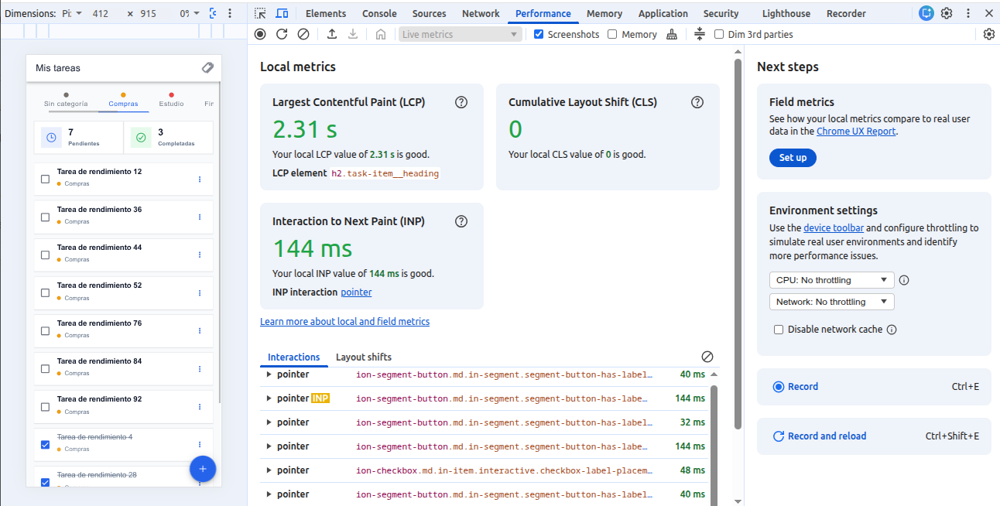

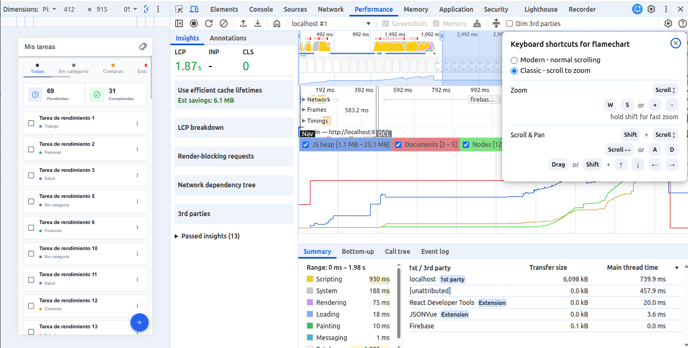

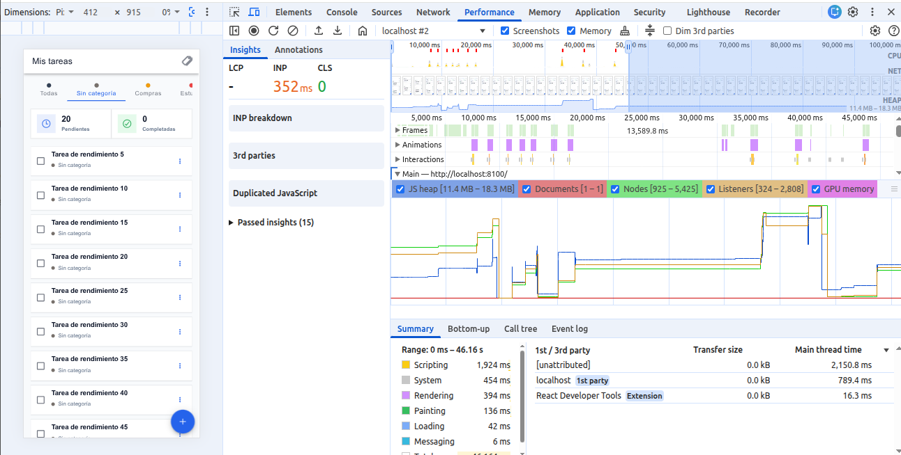

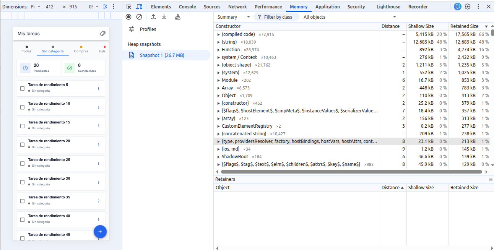

### S2

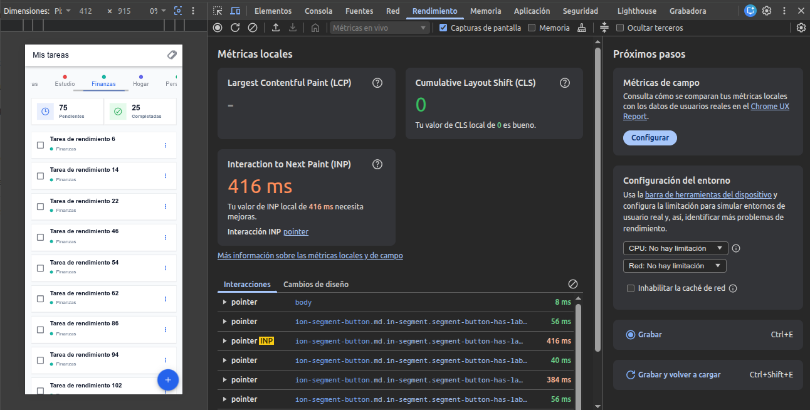

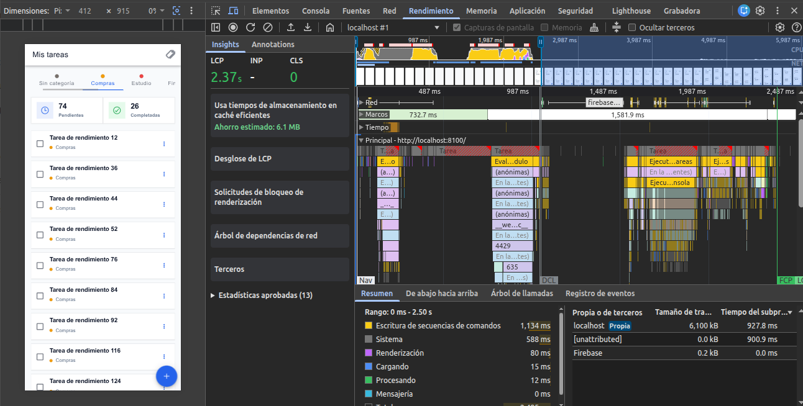

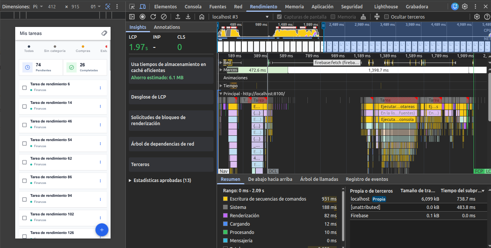

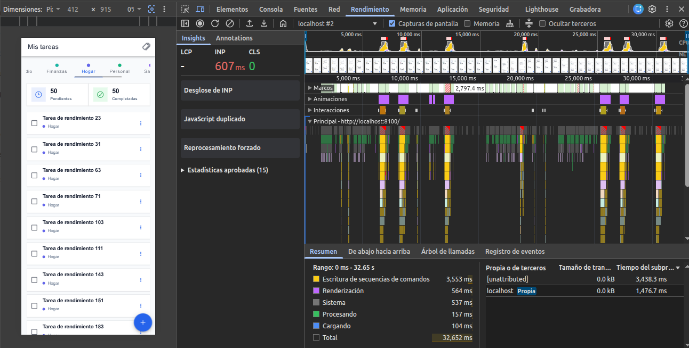

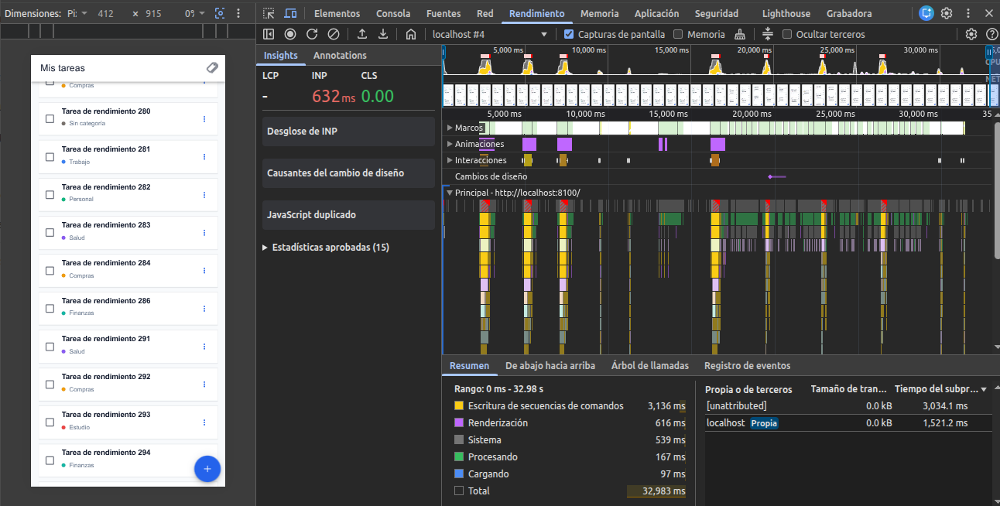

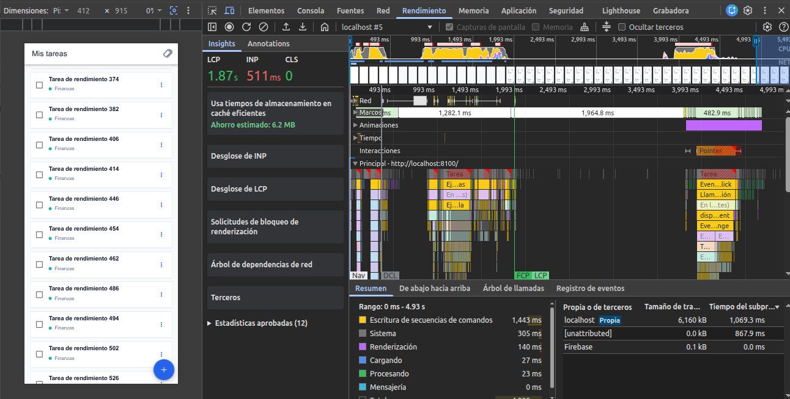

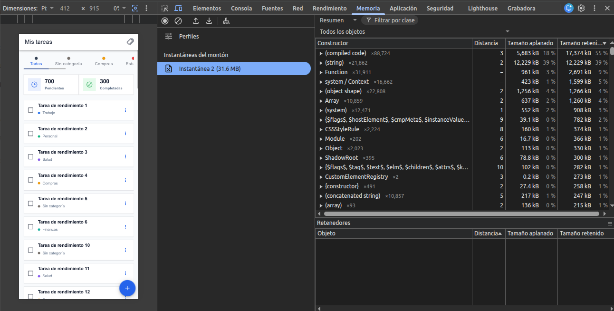

### S3

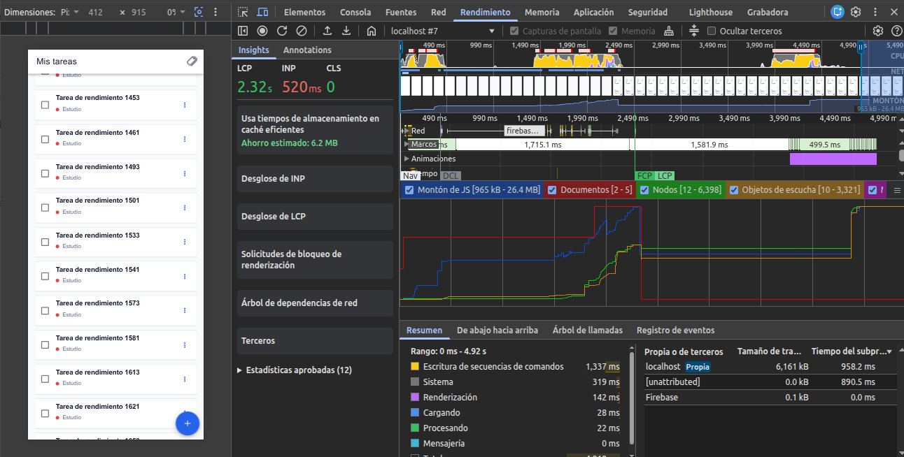

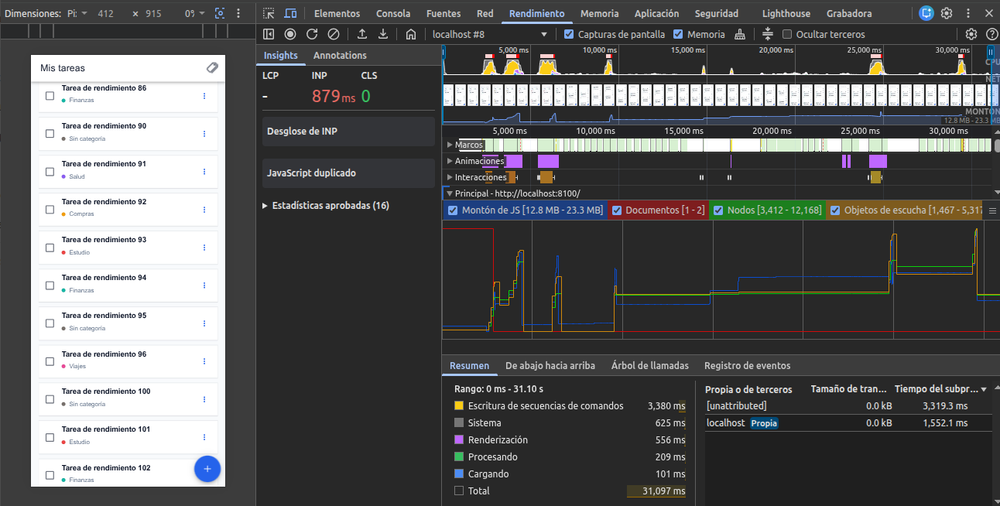

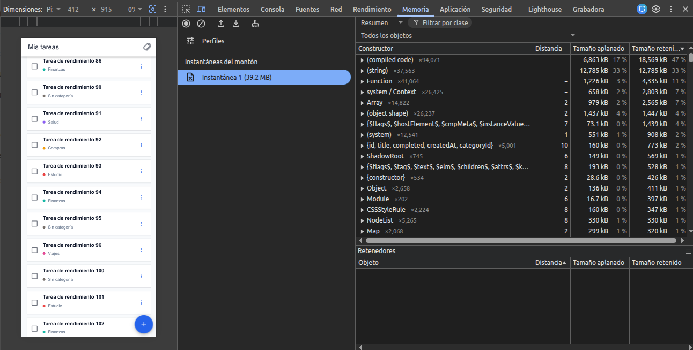

### Extra (contexto / no usados en el texto principal)

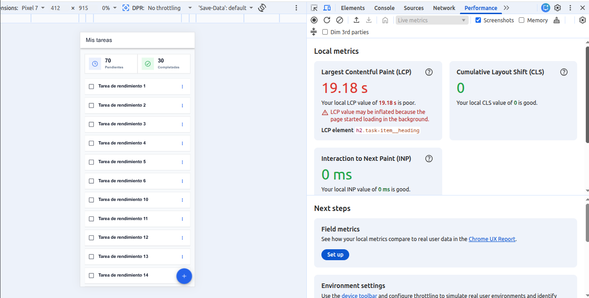

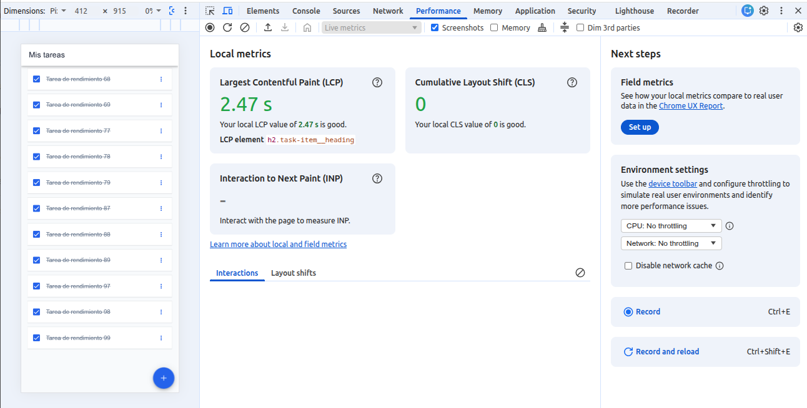
